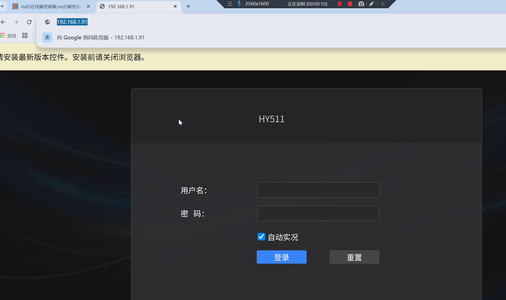
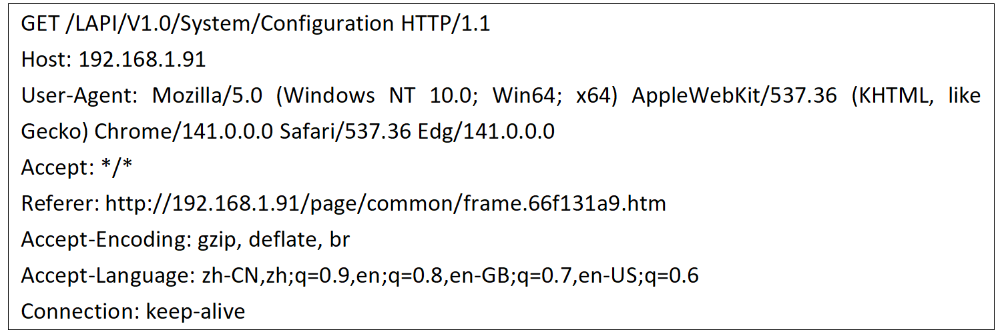
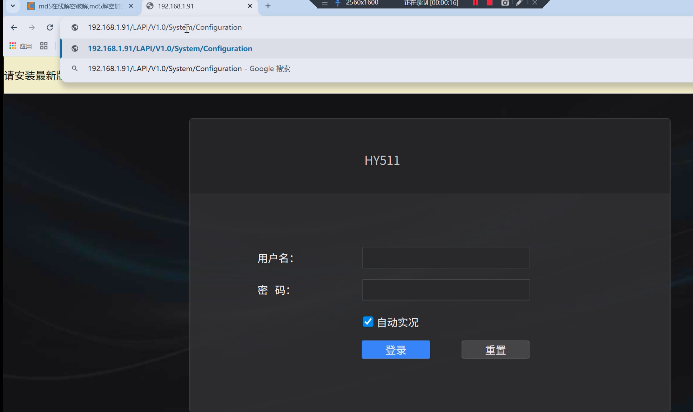
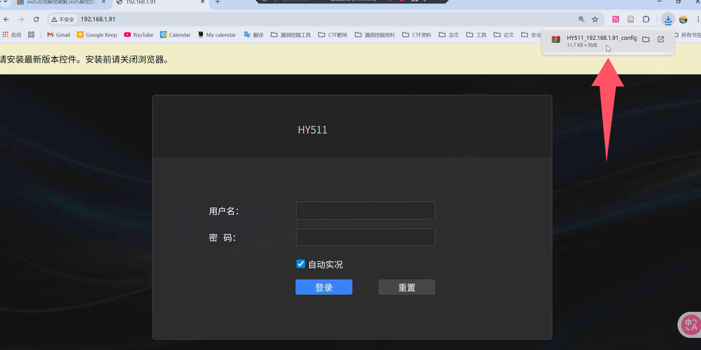
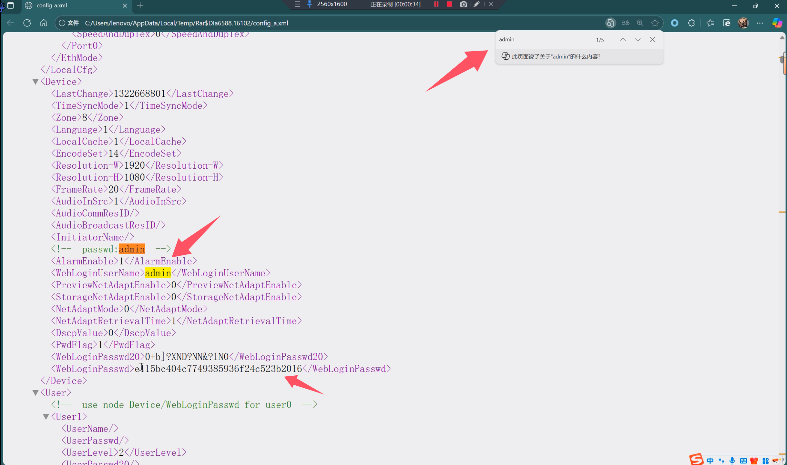
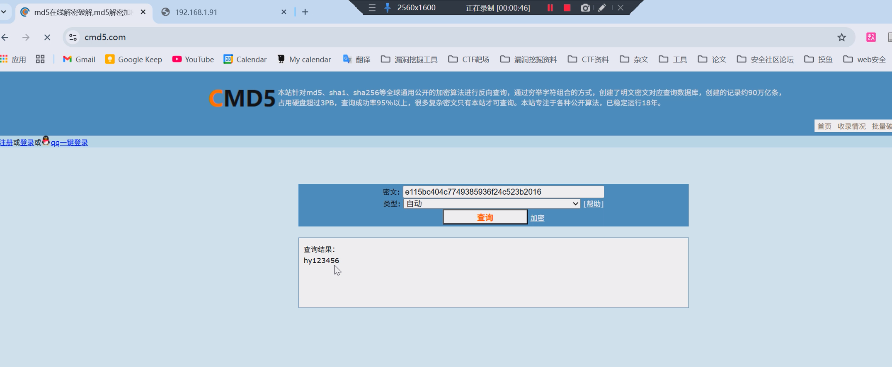
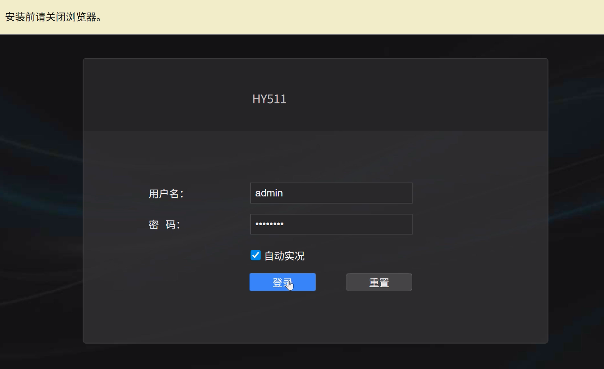
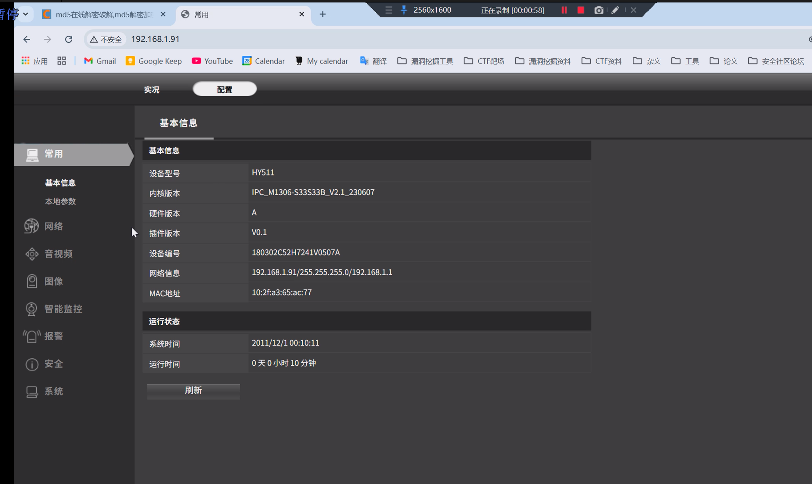

For the HY511 PoE camera device from Hanyuan Technology, if the core panel is earlier than version 2.1, please visit the corresponding backend login page as shown in the image.

We access the following URL address through the direct page: 192.168.1.91/LAPI/V1.0/System/Configuration

Or send the following data packet by capturing the packet in burpSuite

We can directly download the corresponding core configuration file without logging into the backend, mainly because there is no verification of cookie identity information, etc.

Then we read the XML data in the configuration file and search for the admin-related information field to find the corresponding backend login password.

By decrypting with md5, we can directly obtain the corresponding password of the background, which is hy123456

Next we can log in directly to the corresponding background

At this point, we have bypassed the front-end backend login page and directly come to the backend management system, so that we can directly steal information and manage the entire camera.

